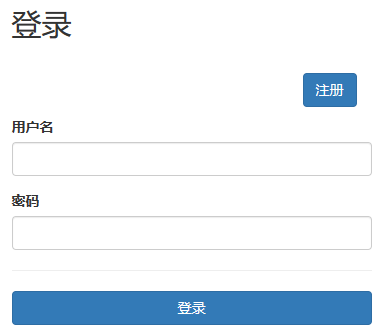
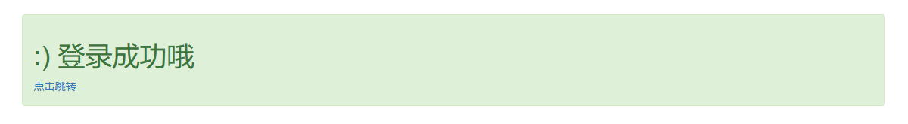
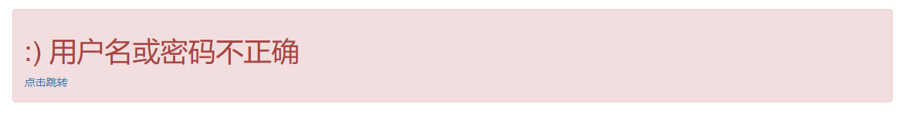
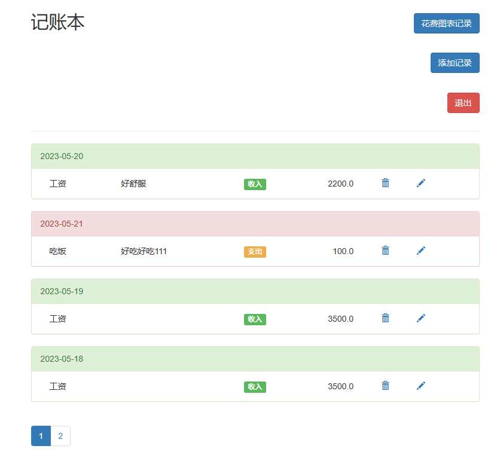
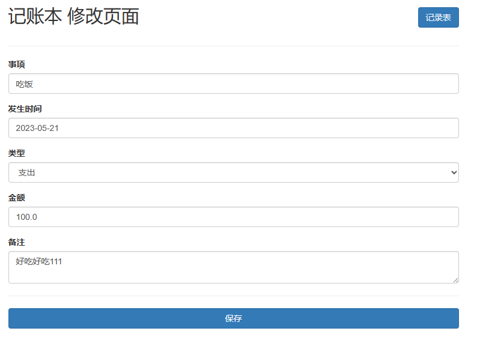
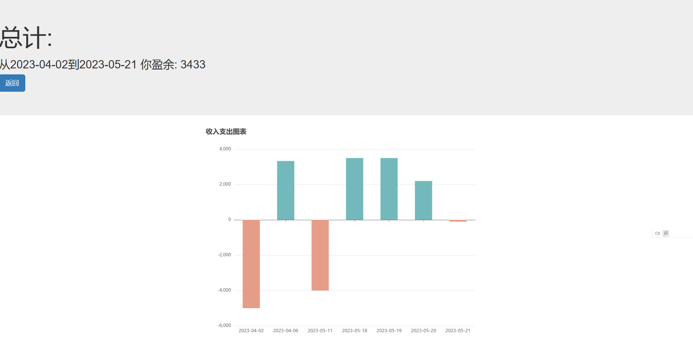

# Django-PocketBook-echarts

## 1页面介绍

使用bootstrap，直接进行简单的登录和注册布局。再通过按钮来进行页面跳转和登录请求。

如果请求成功，先跳转成功页面，

反之跳转失败页面，并且返回失败原因

跳转首页

右上角是添加按钮，图表记录按钮，退出按钮，中间是我们设置账单记录，下面是通过js写的分页，每四个账单一页

账单就显示时间，标题，留言，花费类型，金额，后面还有删除和修改按钮，都是直接使用的bootstrap样式和图标

 

这是修改页面，简单的bootstrap样式，可以直接修改数据

 

这是图标界面，最上方使用bootstrap的巨幕，简单直观的显示，从时间区段的花费，并分析是有余还是入不敷出。下面使用echarts库绘制图表，根据收支和时间来绘制的图标，Y正轴是收入，负轴是支出，X轴是时间

